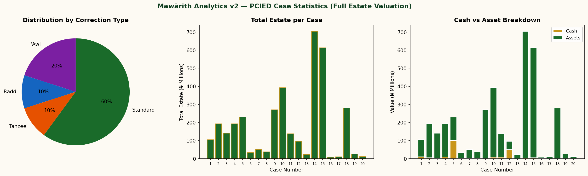

# AMES Fara'id Engine — Automated Islamic Inheritance Calculator

**Project 1 of AMES (Algorithmic Mawārith Execution System)** — a Python engine that computes Islamic (Fiqh al-Mawārith) estate distribution: fixed shares (Fara'id), residue/Asaba allocation, 'Awl (proportional reduction), Radd (proportional return), and Tanzeel distribution for Dhul Arham heirs, applied to full estate valuations (cash + Nigerian market-valued assets).

> This repository is part of a larger AMES suite of sub-projects; this one focuses specifically on inheritance computation.

## Dataset

20 estate cases — Project PCIED 2023, Jāmi'at al-Ḥikmah, Ilorin.

## What it does

- Computes each heir's fixed Qur'anic share or residue (Asaba) entitlement per case
- Applies 'Awl (when shares exceed the estate) and Radd (when shares fall short and no Asaba is present)
- Implements Tanzeel — distribution to Dhul Arham (distant kindred) heirs by representative substitution, per the Hanafi method
- Values full estates, combining cash holdings with a Nigerian market-rate valuation table for vehicles, residential property, land, and other assets
- Flags excluded heirs and no-residue outcomes explicitly, rather than silently returning ₦0

## Contents

| File | Description |
|---|---|
| `mawaarith_engine.py` | v1 engine |
| `mawaarith_engine_v2.py` | v2 engine — full asset valuation, corrected son's-son Asaba logic, Tanzeel for Dhul Arham, explicit excluded-heir labelling |
| `notebooks/Project1_Mawaarith_Engine.ipynb` | v1 analysis notebook |
| `notebooks/Project1_Mawaarith_Engine_v2.ipynb` | v2 analysis notebook — case-by-case reports and summary charts across all 20 cases |
| `Project1_Dashboard.html` | Interactive results dashboard |
| `images/project1_charts.png` | Summary statistics: correction-type distribution, estate value per case, cash vs. asset breakdown |
| `reports/Project1_Mawaarith_Report.docx` | Full written report |

## Results snapshot (v2, across 20 cases)

- **60%** of cases resolved under standard fixed-share/Asaba rules
- **20%** required 'Awl (shares exceeded the estate)
- **10%** required Radd (shares fell short, no Asaba present)
- **10%** required Tanzeel (Dhul Arham distribution)



## Running it

```python
from mawaarith_engine_v2 import *

engine = MawaarithEngine()
results = [engine.compute(c) for c in PCIED_CASES]
print(engine.format_report(results[0]))
```

Requires: `pandas`, `matplotlib`.

## Author

Abdulbasit A. Adedeji (Data Ustadh)
